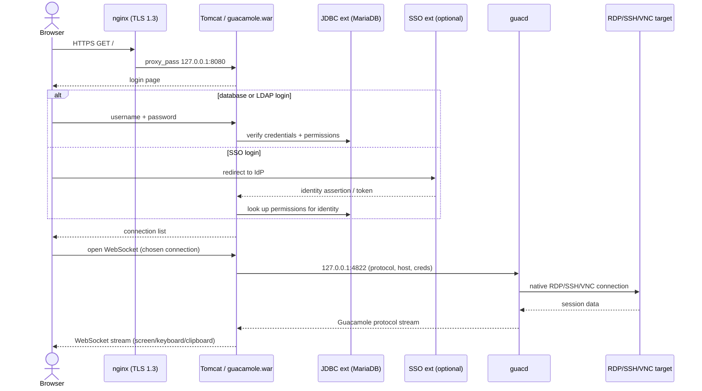

# 1. Architecture Overview

## 1.1 What this system is

A Guacamole jump-host lets a user open an RDP, SSH, or VNC session to a backend server through
nothing but a web browser — no client software, no VPN client, no locally-stored credentials to
the target. The browser talks HTTPS/WebSocket to this host; this host does the actual RDP/SSH/VNC
protocol work on the user's behalf. It is a **bastion**: the only thing that needs network access
to your RDP/SSH/VNC targets is this one host.

## 1.2 The components

| Component | What it is | Why it's here |
|---|---|---|
| **nginx** | Reverse proxy, TLS terminator | The only thing exposed to users. Terminates TLS 1.3, proxies HTTP + WebSocket traffic to Tomcat on `127.0.0.1:8080`. Also (optionally) terminates a second X.509 client-certificate vhost — see Chapter 5. |
| **Tomcat** | Java servlet container | Runs the Guacamole web application (`guacamole.war`). Handles login, the UI, the REST API, and the WebSocket tunnel that carries live session data to and from the browser. |
| **guacamole.war** | The Guacamole web application | Apache's official client, unmodified. Installed under a version-qualified filename (`guacamole-<version>.war`) — see Chapter 7 for why. |
| **guacd** | Guacamole proxy daemon, compiled from source (`guacamole-server`) | Speaks the native RDP/SSH/VNC/telnet/Kubernetes protocols to backend targets and translates them into the Guacamole protocol that Tomcat's webapp streams to the browser. Runs as its own systemd service, listening on `127.0.0.1:4822` by default. |
| **MariaDB** | Relational database | Holds every Guacamole user, connection, connection group, and permission — the JDBC auth backend. Can be local to this host or a separate/remote server (`guac_install_mariadb: false`). |
| **JDBC auth extension** (`guacamole-auth-jdbc-mysql`) | Tomcat extension jar | The database-backed authentication and authorization provider. This is always installed — it's the source of truth for connections and permissions even when SSO is layered on top. |
| **SSO extensions** (`guacamole-auth-sso-*`) | Tomcat extension jars, one per method | Optional identity layers: OpenID Connect, SAML 2.0, X.509 client-certificate/smart-card, CAS. They answer "who is this person?"; the JDBC extension still answers "what are they allowed to do?" See Chapter 5. |
| **Other extensions** | Tomcat extension jars | TOTP, Duo (MFA); LDAP/AD (can supply either authentication or just RBAC group membership); Quick Connect; History Recording Storage; branding. All off by default, each behind its own toggle. |

## 1.3 From a mouse click to a live session

1. A user browses to `https://<guac_proxy_site>/`. **nginx** terminates TLS 1.3 and proxies the
   request to Tomcat on the loopback interface.
2. Tomcat serves the Guacamole login page (from `guacamole.war`).
3. The user authenticates. Depending on configuration this is a database username/password
   checked by the **JDBC extension**, or a redirect to an **SSO** identity provider (OpenID
   Connect / SAML / CAS), or a TLS client-certificate handshake against the dedicated cert vhost.
   Whichever method proves identity, the **JDBC extension**'s database is consulted for what that
   identity is allowed to see and do (its connections, groups, and permissions).
4. If MFA (TOTP or Duo) is enabled, the user completes that challenge next.
5. The authenticated browser now sees a list of connections it has been granted. Clicking one
   opens a WebSocket from the browser to Tomcat.
6. Tomcat's Guacamole webapp opens a connection to **guacd** over `127.0.0.1:4822` (or TLS 1.3 if
   `guac_guacd_tls_enabled`) and tells it which protocol, host, and credentials to use.
7. **guacd** opens the actual RDP/SSH/VNC/telnet/Kubernetes connection to the **backend target**
   and begins translating between that native protocol and the Guacamole protocol.
8. Keyboard, mouse, clipboard, and display/audio data now flow: browser ⇄ WebSocket ⇄ Tomcat ⇄
   guacd ⇄ backend target, in both directions, for the life of the session.
9. When the session ends, guacd closes the backend connection and Tomcat records the fact via the
   JDBC extension (session history, and — if `guac_histrec_enabled` — a browsable recording).

> This sequence diagram is a text fallback for readers of the raw Markdown or a Markdown-aware
> viewer (GitHub, VS Code, etc.). The authoritative, editable architecture diagram — showing host
> boundaries, network segments, and every port — is **`docs/architecture.drawio`**; open it at
> <https://app.diagrams.net>. In the PDF build of this manual the block above renders as a code
> listing rather than a picture (`scripts/build-manual.sh` does not depend on a headless browser
> to rasterize Mermaid); read it as a numbered flow rather than a rendered image.

## 1.4 Trust boundaries

| Boundary | What crosses it | What's enforced there |
|---|---|---|
| **Internet/client network → nginx** | HTTPS (TLS 1.3), WebSocket over TLS | Only port 443 (and 80 for redirect/ACME) is exposed. `server_tokens off`, HSTS, `X-Content-Type-Options`, `X-Frame-Options`, `Referrer-Policy` (see `roles/hardening`). This is the only boundary an anonymous, unauthenticated party can reach. |
| **nginx → Tomcat** | Plain HTTP | Loopback only (`127.0.0.1:8080`) — never routable off-host. `RemoteIpValve` in Tomcat trusts the real client IP nginx forwards, for correct audit logging. |
| **Tomcat → guacd** | Guacamole protocol | Loopback only by default (`127.0.0.1:4822`); optionally TLS 1.3 if guacd and the webapp run on separate hosts (`guac_guacd_tls_enabled: true`). |
| **guacd → backend targets** | Native RDP/SSH/VNC/telnet/Kubernetes protocol | This is the only place session *content* leaves the jump-host. Scope firewall egress per target — see `docs/FIREWALL.md` and Chapter 10. Credentials for the target either come from the connection's stored parameters or are prompted per-session; they are never visible to the browser. |
| **Tomcat/backup → MariaDB** | SQL over a Unix socket (local DB) or TCP 3306 (remote DB) | Local: never leaves the host. Remote: TLS/network-segmented per your DB server's own posture; see Chapter 10. |
| **Guacamole ⇄ Identity Provider** | OpenID Connect / SAML / CAS protocol traffic, or a TLS client-certificate handshake | Only relevant when SSO is enabled (Chapter 5). The IdP proves *identity*; it never receives connection credentials — those stay in the JDBC database. |
| **Ansible control node → this host** | SSH (port 22) | Used only to run `site.yml`. Not part of the runtime data path for a logged-in Guacamole user. |

The practical takeaway: **guacd is the only process that needs network reachability to your
RDP/SSH/VNC estate.** Everything upstream of it (nginx, Tomcat, the database) only needs to talk
to itself, on loopback, or to your identity provider.
